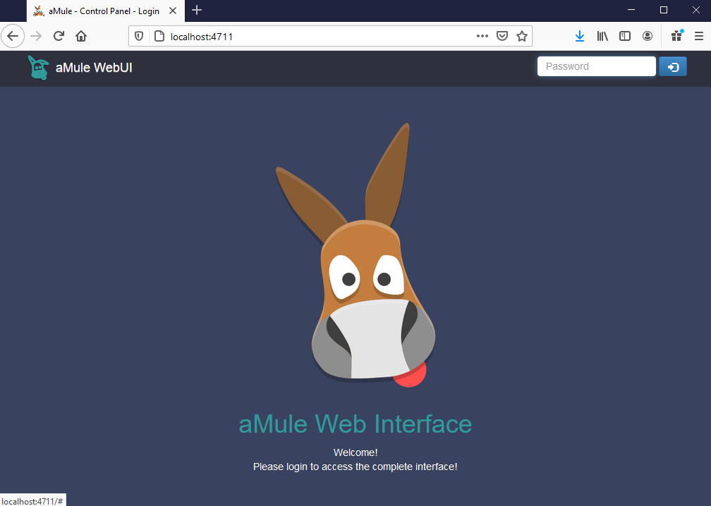

# 🐋 Docker + 🐴 aMule

With this Dockerfile you will generate a image of [aMule](https://www.amule.org/). To be more accurate, the image only has the [amule-dameon](https://packages.debian.org/buster/amule-daemon) [Debian](https://debian.org) package installed and it comes with the WebGUI configured as default.  So the only way to interact with aMule is using the WebGUI.

# Build the Image

To build the image just run this command:

```bash
docker build --no-cache --tag "aMule" Dockerfile
```

# Create/Run a container

Change the path of configuration files folder, Downloaded files, temporary files and WebGUI login password. You can change the TCP/IP ports as well.

```bash
docker run -d --name "CONTAINER_NAME"
-e WEBUI_PWD=YOUR_PASSWORD \
-v 'PATH_WERE_SAVE_CONFIGURATION':'/home/amule/.aMule/' \
-v 'PATH_WHERE_SAVE_DOWNLOADED_FILES':'/Incoming' \
-v 'PATH_WHERE_STORE_ TEMPORAL_FILES':'/Temp' \
-p 4711:4711 \
-p 4662:4662 \
-p 4672:4672/udp \
fortu/amule
```

# Usage

Just open a browser and conect to the **4711** port and use the password you set up before to login.

 
